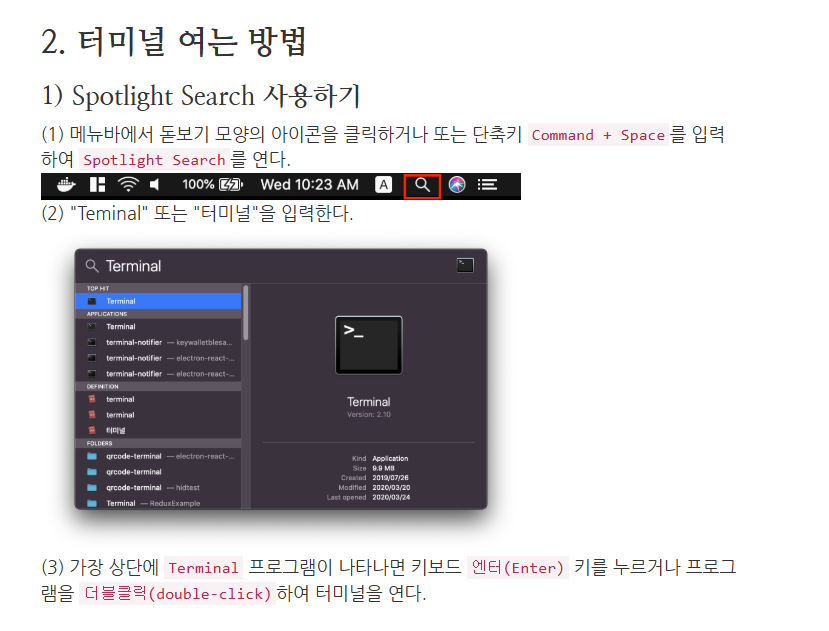

# MAC 설치

[sumo mac build](https://sumo.dlr.de/docs/Installing/MacOS_Build.html)
https://sumo.dlr.de/docs/Downloads.php#macos 
	download sumo
	SUMO_HOME environment
	sumo lunchers download


### git 설치, Homebrew 설치
아래 블로그 링크 따라하기

https://velog.io/@wiseah/Git-%EC%84%A4%EC%B9%98-%EB%B0%8F-%ED%99%98%EA%B2%BD%EC%84%A4%EC%A0%95mac-os


### First

1. Python 설치
	1. terminal
```
brew install python3	   
```


```bash
python3 -V
```

```bash
vi ~/.zshrc
```

```vi
alias python ="python3"
esc + : wq
```

```bash 
source ~/.zshrc
```

https://priming.tistory.com/154
https://jerryjerryjerry.tistory.com/90

2. XQuartz 설치
	1. [https://www.xquartz.org](https://www.xquartz.org/) 접속
	2. .dmg 파일 다운로드 
	3. shift+우클릭 다운로드 파일 진행
	4. mac 로그아웃, 로그인
	5. Launchpad> 기타
	6. $ ssh -X root@local IP sumo

참고 : https://blog.naver.com/asa4209/222219869485
3. sumo-1.24.0.pkg 설치


## second

### Hombrew install is recommended

- terminal 켜기


termainal 순서대로 입력(복붙)

```bash
/bin/bash -c "$(curl -fsSL https://raw.githubusercontent.com/Homebrew/install/master/install.sh)"

```


```bash
brew update
```


```bash
xcode-select --install
```


```bash
clang --version
```


```bash
brew install cmake
```


``` bash
brew install --cask xquartz
```

``` bash
brew install xerces-c fox proj gdal gl2ps
```


```brew
brew install python ccache googletest fmt swig eigen apache-arrow pygobject3 gtk+3 adwaita-icon-theme python3 -m pip install texttest
```


```bash 
git clone --recursive https://github.com/eclipse-sumo/sumo 
```

```bash
export SUMO_HOME="$PWD/sumo"
```

```bash
cd $SUMO_HOME
```

```bash
cmake -B build .
```

```bash
cd $SUMO_HOME
```

```bash
cmake --build build --parallel $(sysctl -n hw.ncpu)
```


Download SUMO lanchers


