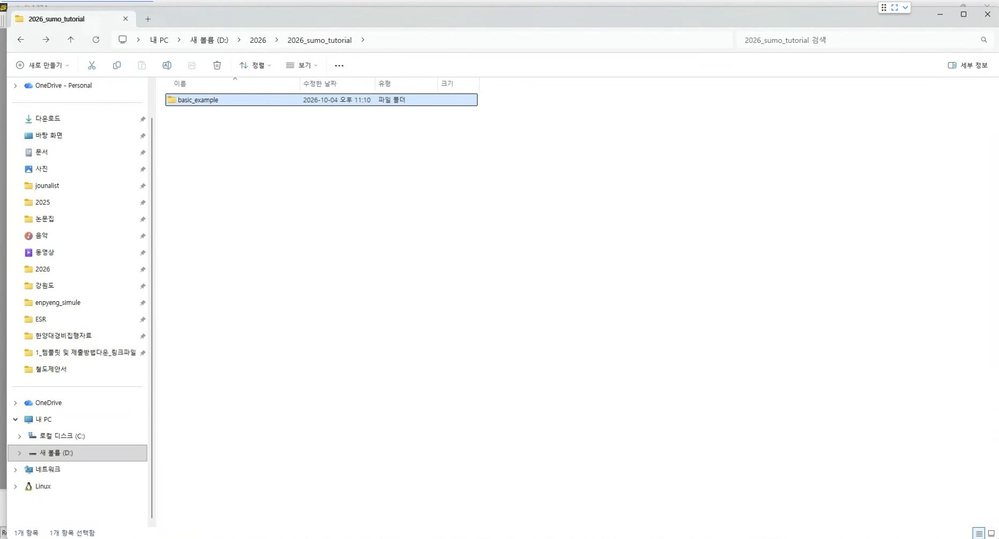
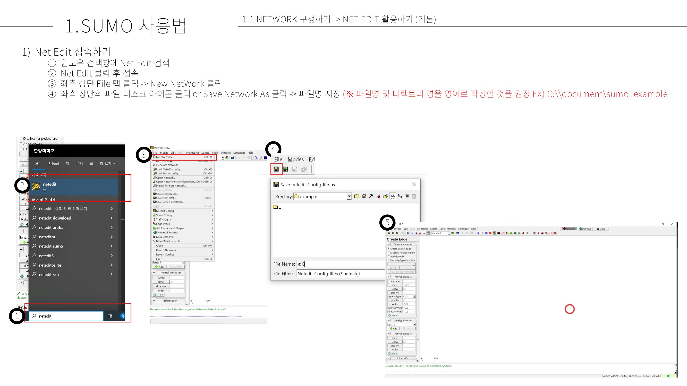
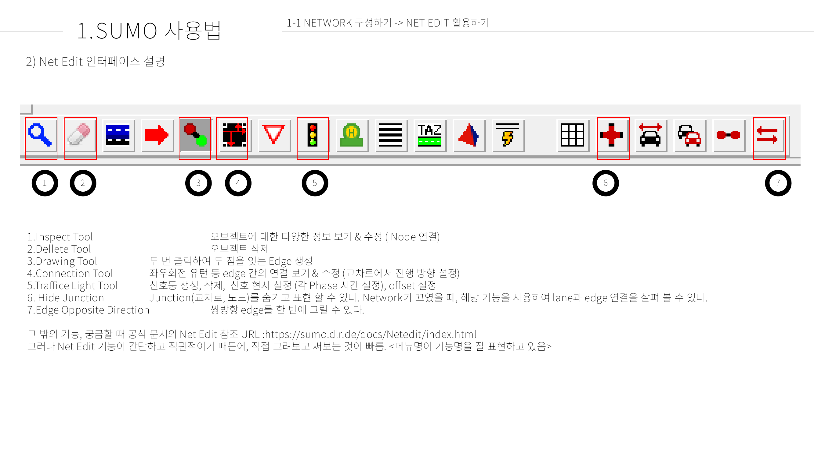
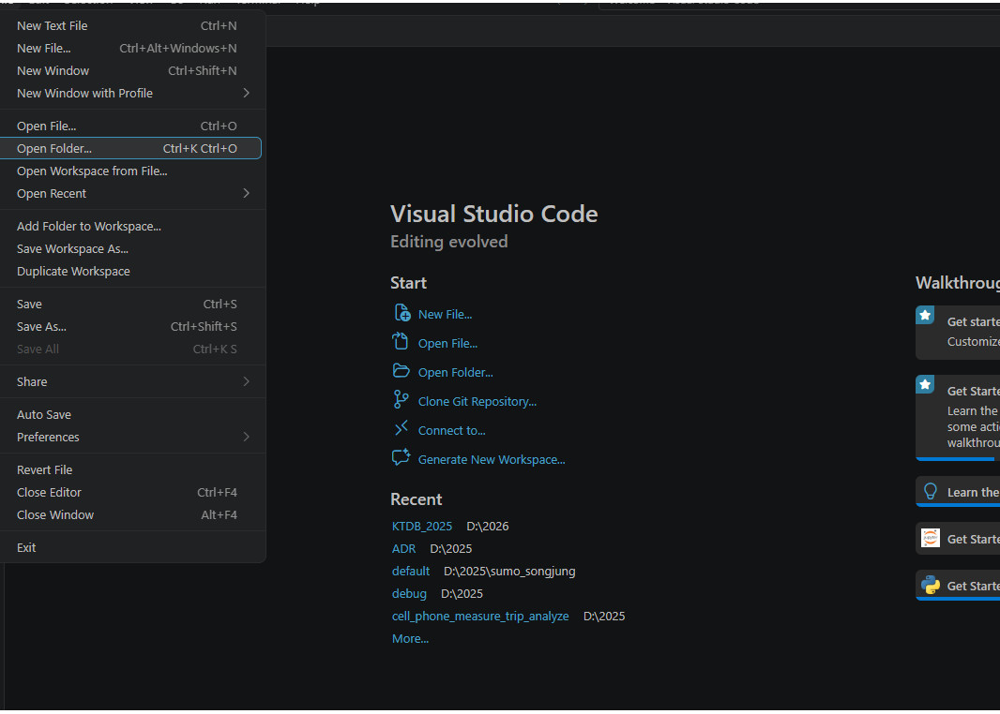
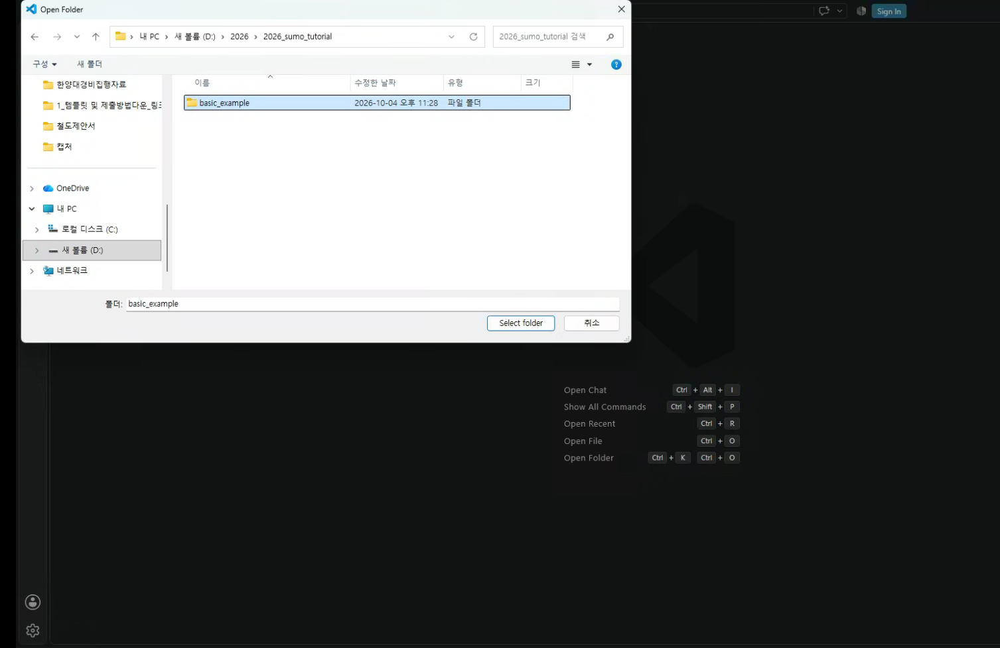
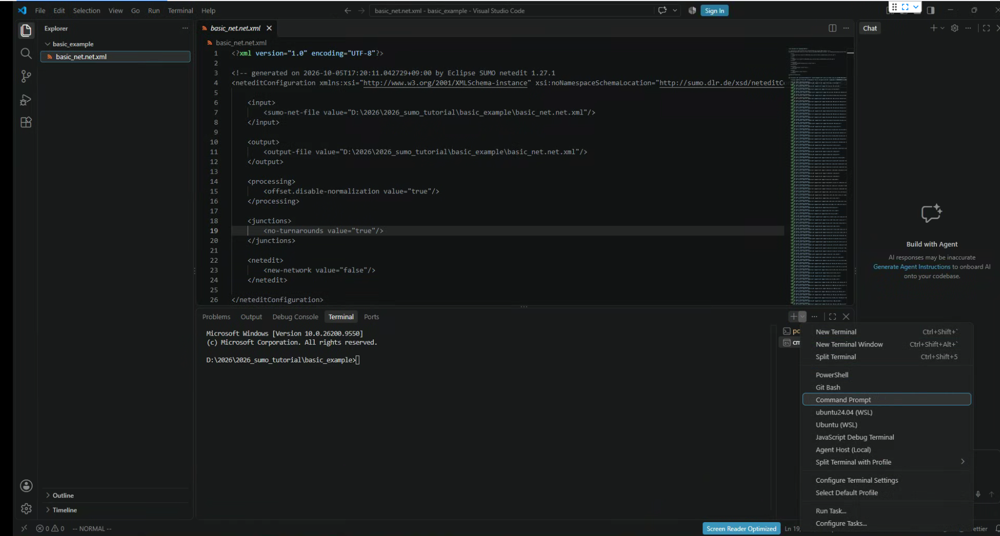

# SUMO 기초 실습

간단한 네트워크 만들기와 통행 생성을 통해서 SUMO 시뮬레이션을 해보는 장입니다. 간단한 실습을 통해서 SUMO를 사용해보는 것이 목적입니다. 이 실습 장 이후에 SUMO 이론과 동작 순서를 설명하겠습니다. 이런 프로그램은 우선 일단 한 번 돌려보면, 사용 순서나 프로그램이 구현하고자 하는 개념을 쉽게 이해할 수 있는 것 같습니다.

실습을 하기 이전에 프로젝트 폴더 만들기, Net Edit 프로그램 여는 법, Net Edit에서 네트워크 저장하는 법, VS CODE에서 프로젝트 폴더 여는 법, VS CODE에서 CMD 여는 법을 먼저 설명 드리겠습니다.

## 프로젝트 폴더 생성
SUMO 시뮬레이션을 위해서는 많은 입력 파일이 필요합니다. 한 개의 폴더에서 시뮬레이션 입력 파일을 관리하는 것이 오류를 찾고, 고치기에 더 쉽습니다. 그래서 하나의 시뮬레이션에 하나의 폴더를 만드는 것이 좋습니다.

폴더 경로명에 한글이 있으면 오류가 생길 수 있습니다. 영문으로 된 경로에 시뮬레이션 프로젝트를 생성하는 것이 좋습니다. `D:\2026\2026_sumo_tutorial\basic_example`과 같은 경로를 권장합니다. 

## Net Edit

Net Edit은 SUMO 네트워크를 생성, 편집할 수 있는 GUI 프로그램입니다. SUMO를 설치한 후, 윈도우 프로그램 창에 `Net Edit`을 검색하여 프로그램을 찾고, 열 수 있습니다. `ctrl+s' 혹은 `File> Save Network`로 네트워크를 저장할 수 있습니다.

### Net edit 기초 도구

Network를 작성하는 가장 기초적인 도구입니다. 그 외 도구 설명은 [SUMO Documentation - Net Edit](https://sumo.dlr.de/docs/Netedit/index.html) 참고 바랍니다.

1. Inspect tool
    - 오브젝트 정보 보기 & 수정 
        - ID 수정
         - Node - Edge 연결정보 수정
         - 개체 속성값(최고 속도, 수단) 수정 등   
2. Delete tool
    - 오브젝트 삭제
3. Drawing tool
    - Edge 생성
4. Connection Tool
    - 좌우회전, 유턴 등 Edge의 차선 lane 간의 교차로 연결 정보 보기 및 수정 기능
5. Traffic Light tool
    - 교차로(Node)에 신호 정보 생성
    - 신호 현시 설정
    - 신호 간 offset 설정
6. Hide junction
    - Juntion(Node) 도형 숨기기, 표출하기
    - Edg와 Node 간 연결이 이상할 때, 해당 기능을 이용하여 lane 간 연결을 볼 수 있다.
7. Edge Opposite Direction
    - 쌍방향 Edge를 한 번에 그릴 수 있다.  

Inspect tool 패널에서 볼 수  있는 Edge 속성 설명

## VS CODE 
### VS CODE에서 프로젝트 폴더 여는 법
1. 윈도우 프로그램 창에서 `vs code` 검색해서 vs code 열기
2. `File> Open Foler` 클릭

2. 미리 생성하여 둔 프로젝트 경로 폴더 선택.  `D:\2026\2026_sumo_tutorial\basic_example`

### VS CODE에서 CMD 여는 법
1. 단축키 `` ctrl + ` `` 누르기  or `Terminal > New Terminal` 클릭
2. 하단 Tabl에서 Termianl tab을 고르고, + 버튼을 누르고 Command Prompt 선택

