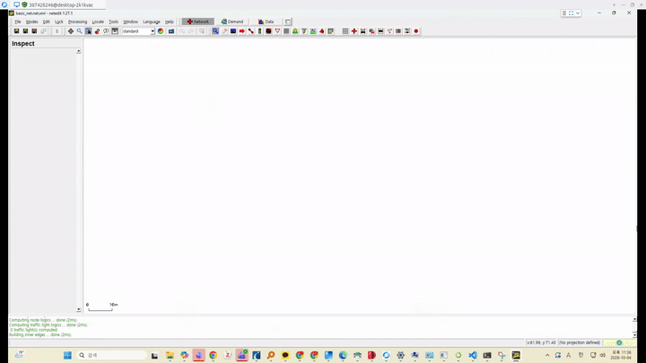
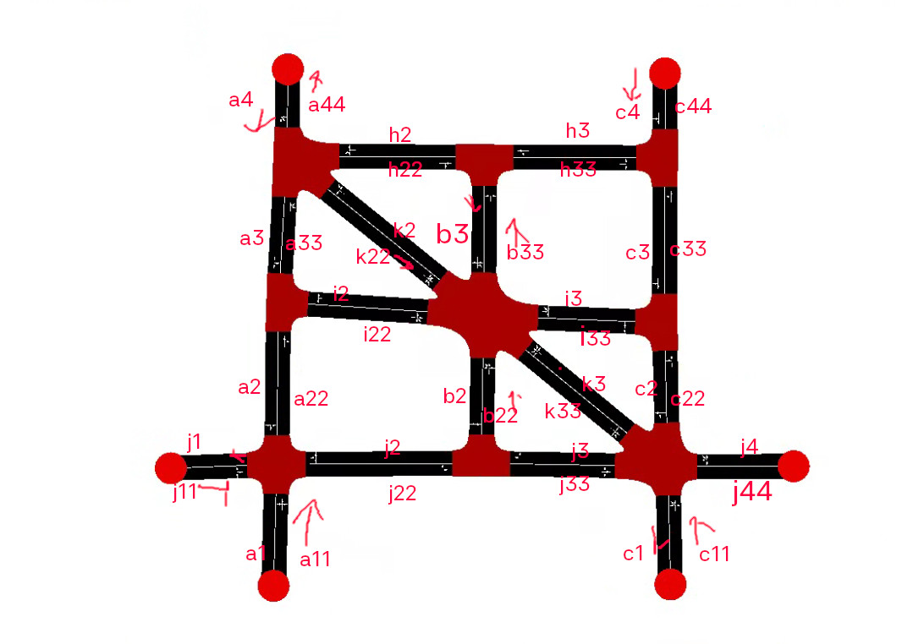
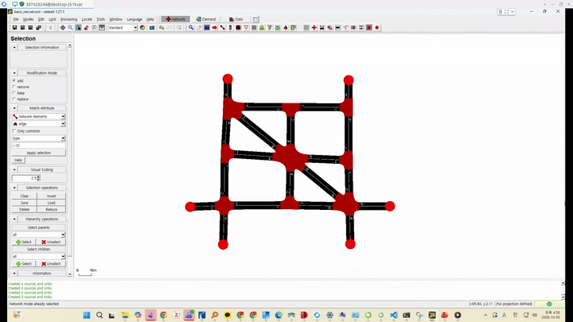
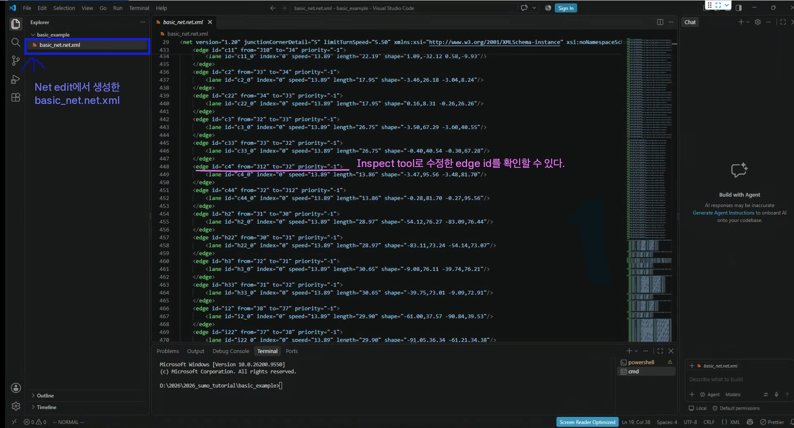

# Network 그리기

1. window 프로그램 창 열고, `net edit` 입력하여, network 편집기 켜기 
   - File > New Network 클릭
   - File > Save Network As 클릭
   - 프로젝트 폴더 선택
   - 파일명으로 `basic_net` 입력

2. Edge Mode 클릭, Edge Opposite Direcition 클릭해서 아래 그림과 같이 그리기
   - 완성 그림

   - EDGE 그리는 법 영상

3. Inspect Tool 이용하여, 각 EDGE의 ID를 그림과 같이 입력해줍니다.
   - 목표 그림

   - ID 입력하는 법 영상

4. VS CODE에서 프로젝트 폴더를 열면, `basic_net.net.xml`이 생성된 것을 확인할 수 있습니다.

