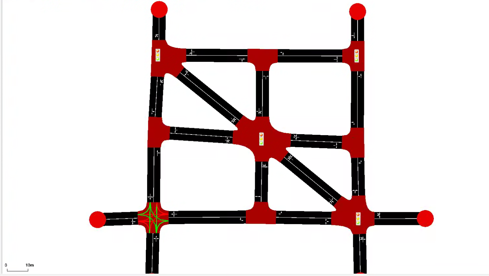
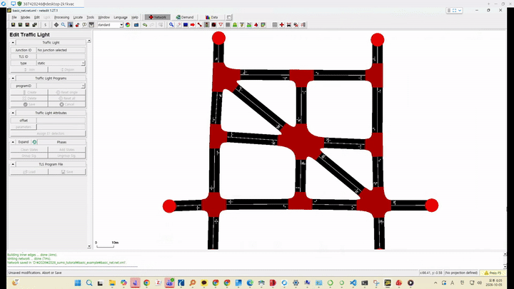
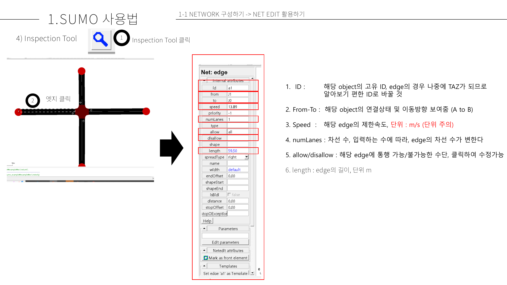

# 신호 입력하기

1. traffic light mode를 클릭하고, 교차로(Junction)을 선택하면 신호를 생성할 수 있다. 아래 그림과 같이 신호를 생성해봅시다.
   - 그림 

   - 영상

1. 좌측 `Edit Traffic Light` 패널의 Phases에서 신호 현시를 설정할 수 있다.

각 소문자는 교차로에서 lane-lane 간의 신호 상태를 의미한다. 
시계 방향 순으로 정렬된다.
r을 빨간불, g는 비보호 초록불, y는 노란불, G은 초록불이다.

Offset을 통해 신호 간 시간 간격을 설정할 수 있다.

3. 더 궁금한 것이 있다면 [sumo document - traffic lights](https://sumo.dlr.de/docs/Simulation/Traffic_Lights.html)을 참고하시기 바랍니다.