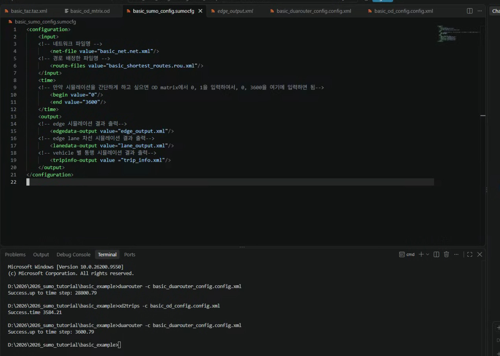
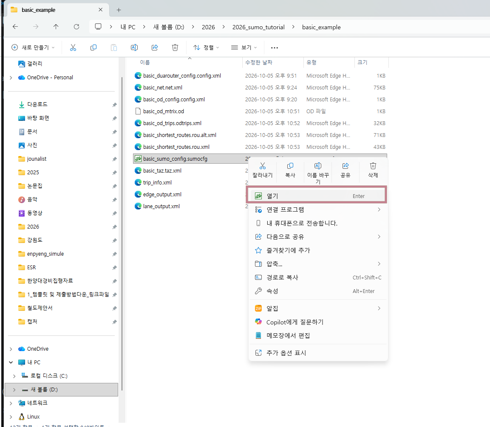
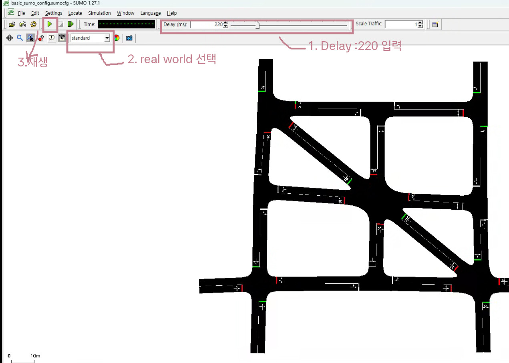
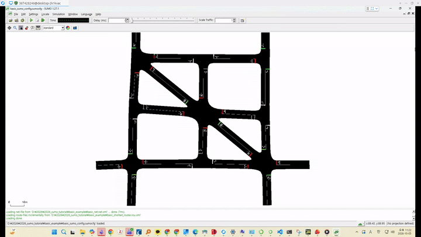
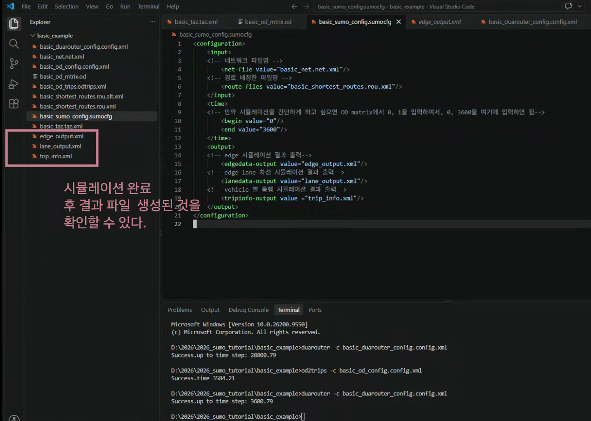

# 시뮬레이션 하기

네트워크와 교통 수요를 만들었으니, 이제 시뮬레이션을 하면 됩니다. sumo는 시뮬레이션 엔진 프로그램입니다. sumo를 동작하려면 어떤 네트워크 파일과 교통 수요 파일을 사용할 것인지 정의해줘야합니다.  이또한 od2trips와 duarouter처럼, sumo_configuration 파일로 정의할 수 있습니다. 또한, 시뮬레이션 이후에 결과 파일을 무엇을 받을지도 정의할 수 있습니다.

## sumo configuration 정의하기
1. vs code 열기 > 새파일 > 파일명 `basic_sumo_config.sumocfg` 입력, 확장자 sumocfg여야 합니당!

2. 파일에 아래 내용 입력
```xml
<configuration>
    <input> 
    <!-- 네트워크 파일명 -->
        <net-file value="basic_net.net.xml"/> 
    <!-- 경로 배정한 파일명 -->
        <route-files value="basic_shortest_routes.rou.xml"/> 
    </input> 
    <time> 
    <!-- 만약 시뮬레이션을 간단하게 하고 싶으면 OD matrix에서 0, 1을 입력하여서, 0, 3600을 여기에 입력하면 됨-->
        <begin value="0"/> 
        <end value="3600"/> 
    </time>
    <output>
    <!-- edge 시뮬레이션 결과 출력-->
        <edgedata-output value="edge_output.xml"/>
    <!-- edge lane 차선 시뮬레이션 결과 출력-->
        <lanedata-output value="lane_output.xml"/>
    <!-- vehicle 별 통행 시뮬레이션 결과 출력-->
        <tripinfo-output value ="trip_info.xml"/>
    </output>
</configuration>
```


3. 윈도우 파일 탐색기 켜기 > 프로젝트 폴더 > 'basic_sumo_config.sumocfg'위에서 오른쪽 마우스키 클릭 > sumo 열기 클릭


4. 상단 도구줄에서 delay 200 입력, standard > real world로 변경, 재생 버튼 클릭


시뮬레이션 영상


5. 3600초 동안의 시뮬레이션이 완료되고 나서, vs code에서 프로젝트 폴더를 열어보면 output file이 만들어진 것을 확인할 수 있습니다.



