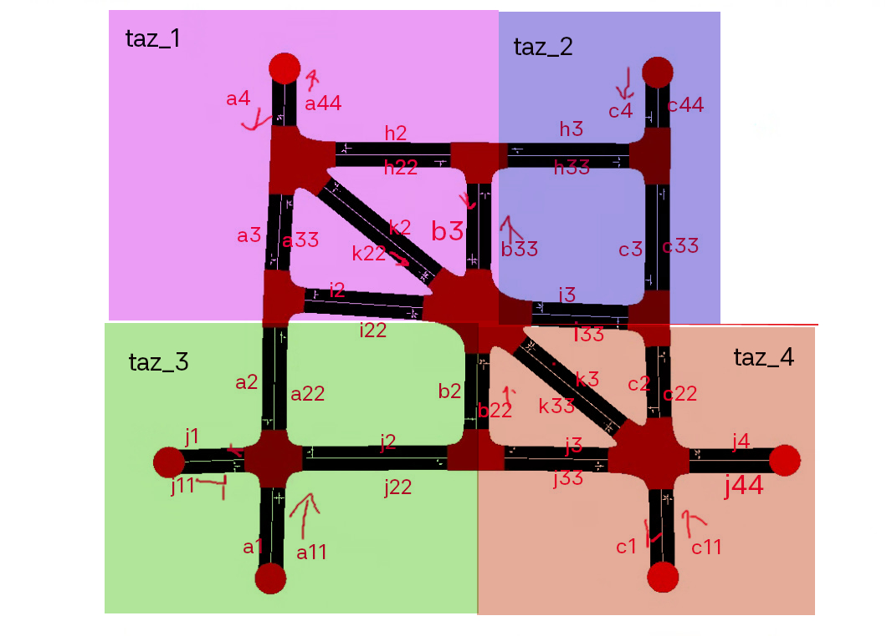
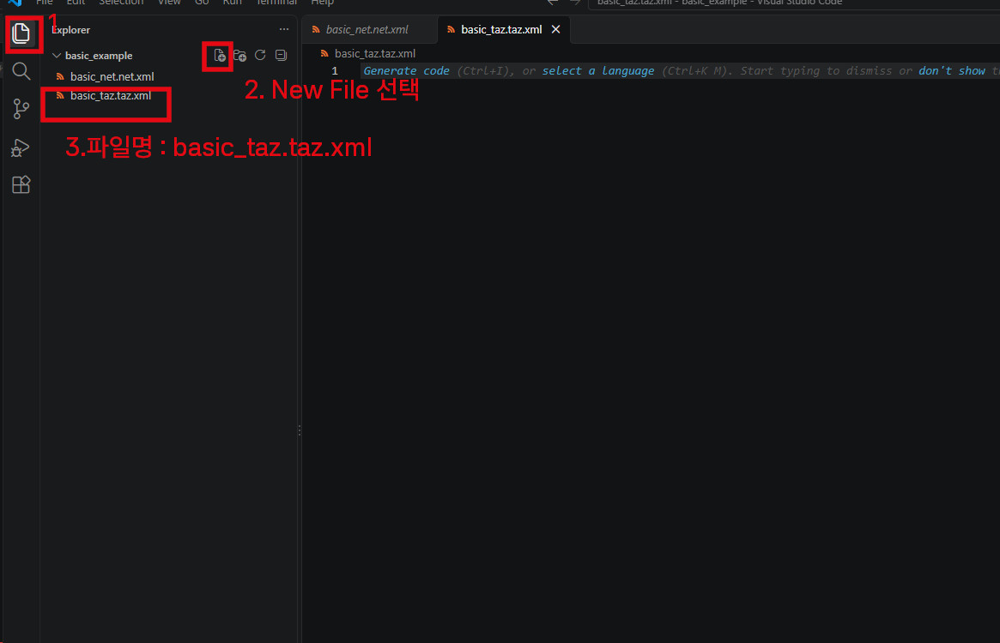
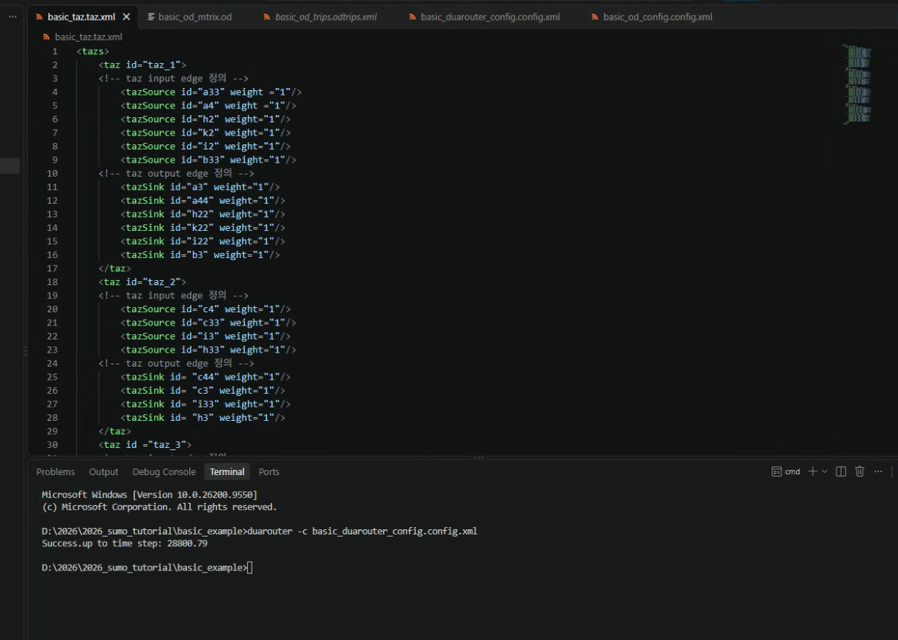
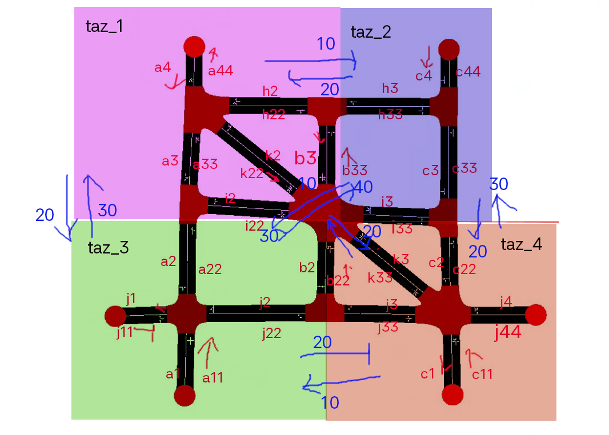
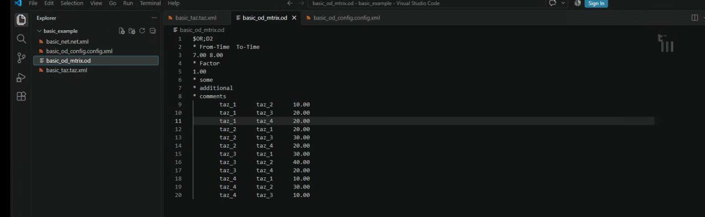
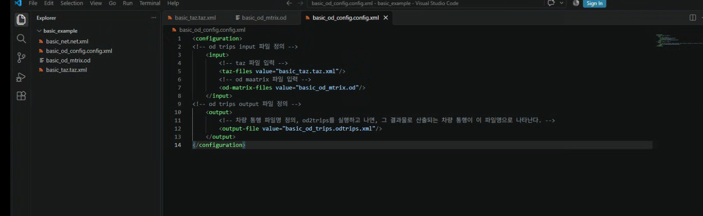
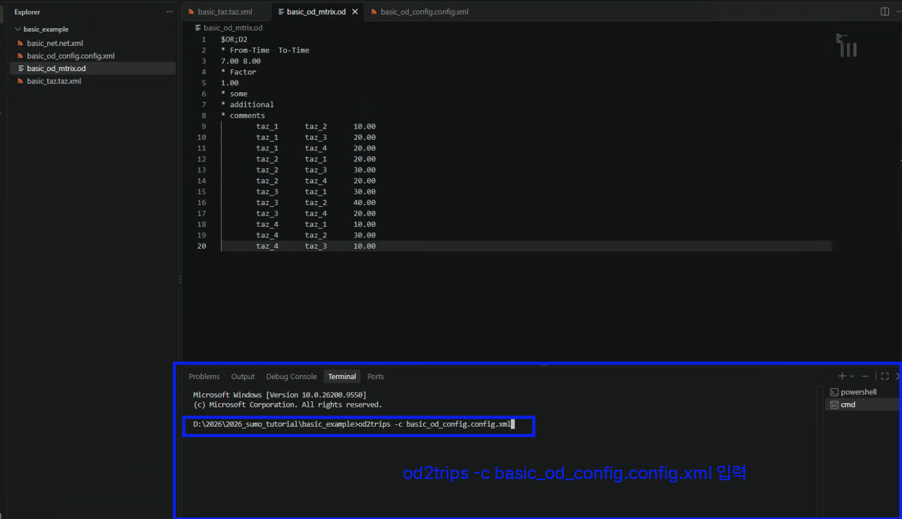
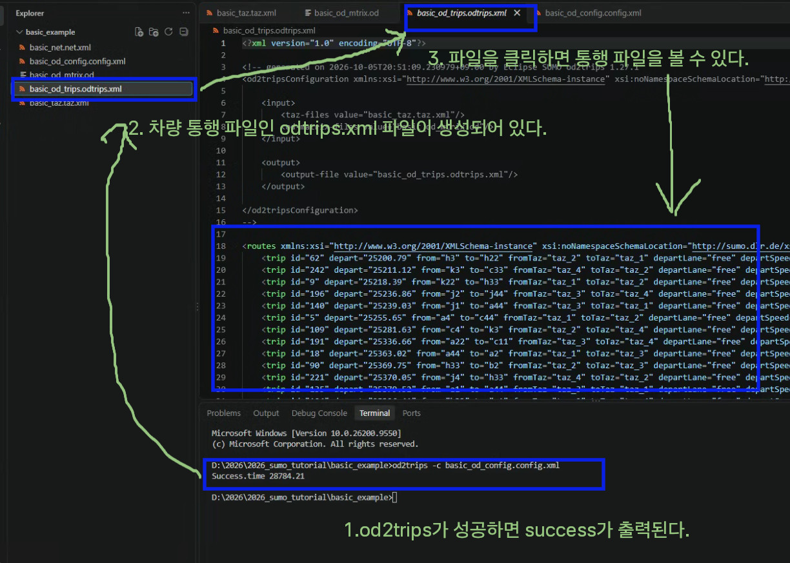
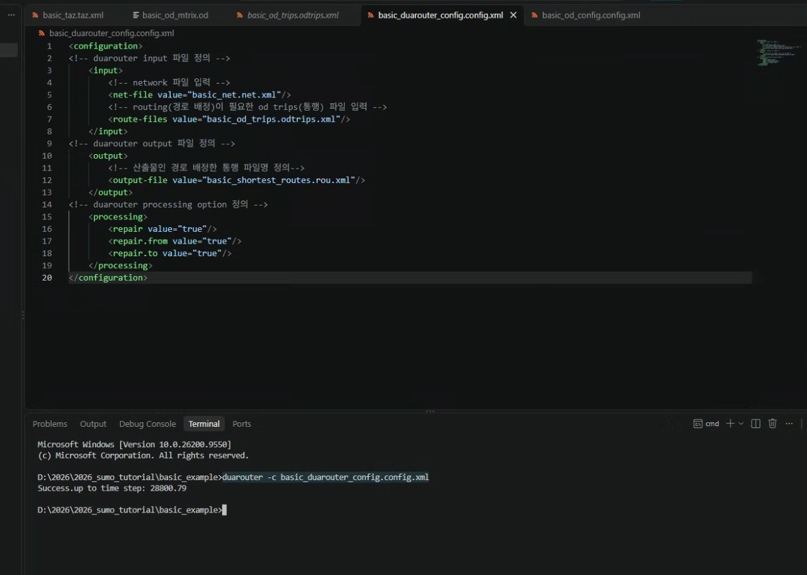
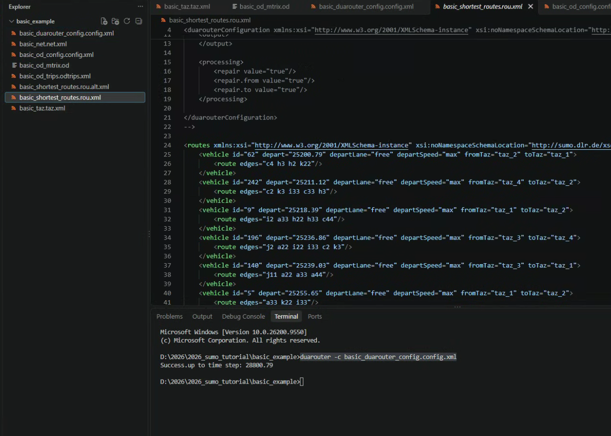

# 교통 수요 생성

도로 위를 지나는 차량은 이 네트워크에 대한 교통 수요라고 볼 수 있습니다. 교통 수요를 SUMO에 입력하면, 특정 교통 수요가 발생했을 때의 네트워크에서의 교통 흐름을 볼 수 있습니다. 

교통 흐름을 보기 위해서는 우선 교통 수요를 추정해야합니다. 교통 수요는 4단계로 추정합니다. ==통행 발생, 통행 분포, 수단 선택, 통행 배정==입니다. 

우선 기본 예제 에서는 이미 수단이 차량으로 선택되어 있기 때문에, 차량의 통행 발생, 통행 분포, 통행 배정의 결과를 추정하면 됩니다. 이 추정 결과를 SUMO에 입력하면 차량 시뮬레이을 볼 수 있습니다. 

SUMO는 통행 발생, 통행 분포, 노선 배정을 할 수 있는 프로그램을 제공합니다. 

이번 기본 실습에서는 차량 통행 발생, 차량 통행 분포, 차량 통행 배정 즉 노선 배정(routing)을 해 보겠습니다.

## 통행 발생, 통행 분포 생성
sumo에서는 차량 통행 발생과 통행 분포를 `od2trips` 프로그램으로 수행할 수 있습니다. OD matrix 파일을 만들고, 이 파일을 od2trips에 넣어주면, OD matrix에 맞춰 차량 통행을 생성할 수 있습니다.

### TAZ 정의
OD matrix를 만들기 전에 우선, 이 OD가 되는 TAZ(Traffic Analysix Zone)을 설정해야합니다. sumo에서 taz는 edge들의 합으로 구성됩니다. 그러므로, 개별 edge를 taz로 만들어도 되고, 여러개의 edge를 묶어서 하나의 TAZ로 구성할 수 있습니다.

이번 실습에서는 아래 그림과 같이 4개의 TAZ를 구성해보겠습니다. 


SUMO에서 TAZ 정의는 `taz.xml`파일을 통해 정의 할 수 있습니다.
TAZ 정의 파일명 : `basic_taz.taz.xml`

1. vs code에서 프로젝트 폴더 열기 -> 프로젝트 폴더 옆 `New File 아이콘 클릭` 혹은 `오른쪽 마우스 클릭 > New File'클릭 -> 파일명 `basic_taz.taz.xml`입력


2. 위 **taz 정의** 그림과 같이 taz와 edge 연결 관계 정의하기 위해 xml 파일을 아래와 같이 작성하고 파일을 저장합니다. 
   taz의 입구 도로, 출구 도로를 각각 source와 sink로 표기합니다. source edge와 sink edge를 정의하지 않으면, od2trips에서 도로 연결 관계에 맞지 않은 통행을 생성하게 되고, 이 통행에 경로를 배정할 수 없어 시뮬레이션을 진행할 수 없게 됩니다. sink, source 표기를 통해 도로의 연결 관계를 반영하여 통행을 생성할 수 있습니다.

```xml
<tazs>
    <taz id="taz_1"> 
    <!-- taz input edge 정의 -->
        <tazSource id="a33" weight ="1"/>
        <tazSource id="a4" weight ="1"/>
        <tazSource id="h2" weight="1"/>
        <tazSource id="k2" weight="1"/>
        <tazSource id="i2" weight="1"/>
        <tazSource id="b33" weight="1"/>
    <!-- taz output edge 정의 -->
        <tazSink id="a3" weight="1"/>
        <tazSink id="a44" weight="1"/>
        <tazSink id="h22" weight="1"/>
        <tazSink id="k22" weight="1"/>
        <tazSink id="i22" weight="1"/>
        <tazSink id="b3" weight="1"/>
    </taz>
    <taz id="taz_2">
    <!-- taz input edge 정의 -->
        <tazSource id="c4" weight="1"/>
        <tazSource id="c33" weight="1"/>
        <tazSource id="i3" weight="1"/>
        <tazSource id="h33" weight="1"/>
    <!-- taz output edge 정의 -->
        <tazSink id= "c44" weight="1"/>
        <tazSink id= "c3" weight="1"/>
        <tazSink id= "i33" weight="1"/>
        <tazSink id= "h3" weight="1"/>
    </taz>
    <taz id ="taz_3">
    <!-- taz input edge 정의 -->
        <tazSource id="a2" weight="1"/>
        <tazSource id="a11" weight="1"/>
        <tazSource id="j11" weight="1"/>
        <tazSource id="j2" weight="1"/>
        <tazSource id="b2" weight="1"/>
    <!-- taz output edge 정의 -->
        <tazSink id= "a22" weight="1"/>
        <tazSink id= "a1" weight="1"/>
        <tazSink id= "j1" weight="1"/>
        <tazSink id="j22" weight="1"/>
    </taz>
    <taz id ="taz_4">
    <!-- taz input edge 정의 -->
        <tazSource id= "c11" weight="1"/>
        <tazSource id= "j4" weight="1"/>
        <tazSource id= "k33" weight="1"/>
        <tazSource id= "c2" weight="1"/>
    <!-- taz output edge 정의 -->
        <tazSink id= "c1" weight="1"/>
        <tazSink id= "j44" weight="1"/>
        <tazSink id= "k3" weight="1"/>
        <tazSink id= "c22" weight="1"/>
        <tazSink id= "b22" weight="1"/>
    </taz>
</tazs>

```


### OD matrix 정의

아래 그림 파란색 화살표와 숫자를 차량의 이동이라고 합시다.



이와 같은 OD 차량 흐름을 표로 정리할 수 있습니다.

| O | D | car volume |
|---|---|-----------:|
| taz_1 | taz_2 | 10.00 |
| taz_1 | taz_3 | 20.00 |
| taz_1 | taz_4 | 20.00 |
| taz_2 | taz_1 | 20.00 |
| taz_2 | taz_3 | 30.00 |
| taz_2 | taz_4 | 20.00 |
| taz_3 | taz_1 | 30.00 |
| taz_3 | taz_2 | 40.00 |
| taz_3 | taz_4 | 20.00 |
| taz_4 | taz_1 | 10.00 |
| taz_4 | taz_2 | 30.00 |
| taz_4 | taz_3 | 10.00 |

이 표를 od2trips가 읽을 수 있는 od matrix 파일로 작성해봅시다.


1. vscode 열기 > 새파일 > 파일명 `basic_od_matrix.od` 작성
2. 아래의 od matrix 파일을 입력하고 파일 저장

```
$OR;D2
* From-Time  To-Time
0.00 1.00
* Factor
1.00
* some
* additional
* comments
        taz_1      taz_2      10.00
        taz_1      taz_3      20.00
        taz_1      taz_4      20.00
        taz_2      taz_1      20.00
        taz_2      taz_3      30.00
        taz_2      taz_4      20.00
        taz_3      taz_1      30.00
        taz_3      taz_2      40.00
        taz_3      taz_4      20.00
        taz_4      taz_1      10.00
        taz_4      taz_2      30.00
        taz_4      taz_3      10.00
```


코드 설명

| 줄 | 의미 |
|---|---|
| `$OR;D2` | PTV O-format 매트릭스 |
| `0.00 1.00` | 시뮬레이션 시작·종료 시각 1시간 시뮬레이션 |
| `1.00` | car volume에 곱하는 scale 상수 |
| `taz_1 taz_2 10.00` | 출발 TAZ, 도착 TAZ, 차량 수 |
| * | 주석 표기 |

*상세한 matrix 파일 설명은 [sumo document - od matrix > PTV formats](https://sumo.dlr.de/docs/Demand/Importing_O/D_Matrices.html)에서 확인하실 수 있습니다.*


### od2trips configuration 파일 작성

taz 정의와 od matrix 정의를 od2trips 프로그램에 전달하면, od2trips 프로그램을 통해 차량 통행 파일 trips을 생성할 수 있습니다. 이런 입력 파일과 결과 파일을 어떻게 od2trips에 입력할 수 있을까요? configuration 파일을 통해 od2trips의 입력, 결과 파일을 전달 할 수 있습니다. configuration은 설정을 의미하며, od2trips 프로그램 설정을 xml로 작성한 것입니다.


1. vs code 열기 > 새 파일 > 파일명 `basic_od_config.config.xml` 입력 
2. 아래와 같이 od2trips configuration을 입력하고 파일 저장

```xml
<configuration>
<!-- od2trips input 파일 정의 -->
    <input>
        <!-- taz 파일 입력 -->
        <taz-files value="basic_taz.taz.xml"/>
        <!-- od maatrix 파일 입력 -->
        <od-matrix-files value="basic_od_mtrix.od"/>
    </input>
<!-- od2trips output 파일 정의 -->
    <output>
        <!-- 차량 통행 파일명 정의, od2trips를 실행하고 나면, 그 결과물로 산출되는 차량 통행이 이 파일명으로 나타난다. -->
        <output-file value="basic_od_trips.odtrips.xml"/>
    </output>
</configuration>
```


상세한 od2trips의 configuration 속성값은 [sumo document od2trips](https://sumo.dlr.de/docs/od2trips.html)에서 확인할 수 있습니다.


### od2trips 차량 통행 생성하기

1. vs code 프로젝트 폴더에서 터미널 열고, cmd 켜기 (`` `ctrl+` ``) 아래 명령어 입력

```cmd
od2trips -c basic_od_config.config.xml
```


2. od2trips 프로그램이 성공하면, configuration에서 정의하였던 산출물 차량 통행 파일 `basic_od_trips.odtrips.xml`이 나타난다. 이로서 통행이 생성되었다!



3. `basic_od_trips.odtrips.xml` 파일에 나타난 통행을 해석할 수 있다. 만약 통행 즉 `trip`이 아래의 코드와 같의 나타나있다면, 이는 id 62 통행이 0초에 h3에서 출발해서 h22로 같나든 것이다. 출발 taz는 taz_2이고, 종료 taz는 h22가 속한 taz_1이다. 이와 같이 od2trips로 생성한 통행은 출발시각, 출발지, 목적지만 나타나있고, 그 경로는 나타나있지 않다. 고로, 다음 작업은 각 통행에 경로를 배정하는 일입니다.
```xml
    <trip id="62" depart="0" from="c4" to="k22" fromTaz="taz_2" toTaz="taz_1" departLane="free" departSpeed="max"/>
```

## 통행에 경로 배정 하기

sumo에서는 경로를 배정하는 여러가지 프로그램을 제공합니다. 이번 기초 실습에서는 **duarouter**를 이용하여 경로를 배정합니다. duarouter는 통행에 최단 경로를 배정하는 프로그램입니다. duarouter 이외에도 많은 경로 배정 방법이 있습니다만, 이는 tutorial의 범위를 넘어서서 다루지 않습니다. 심화사항은 [sumo documentation - introduction to demand modeling in sumo](https://sumo.dlr.de/docs/Demand/Introduction_to_demand_modelling_in_SUMO.html)에서 확인하실 수 있습니다.


**duarouter**도 **od2trips**와 동일하게 configuration 파일을 통해, 입력, 결과 파일을 정의할 수 있습니다.

1. vscode 열기 > new file > 파일명: `basic_duarouter_config.config.xml` 만들기

2. 아래의 duarouter configuration 입력한 뒤, 파일 저장

```xml
<configuration>
<!-- duarouter input 파일 정의 -->
    <input>
        <!-- network 파일 입력 -->
        <net-file value="basic_net.net.xml"/>
        <!-- routing(경로 배정)이 필요한 od trips(통행) 파일 입력 -->
        <route-files value="basic_od_trips.odtrips.xml"/>
    </input>
<!-- duarouter output 파일 정의 -->
    <output>
        <!-- 산출물인 경로 배정한 통행 파일명 정의-->
        <output-file value="basic_shortest_routes.rou.xml"/>
    </output>
<!-- duarouter processing option 정의 -->
    <processing>
        <repair value="true"/>
        <repair.from value="true"/>
        <repair.to value="true"/>
    </processing>
</configuration>
```

3. vs code에서 cmd 열기 > 아래 명령어 입력
```cmd
duarouter -c basic_duarouter_config.config.xml
```


4. 명령이 성공하면, 폴더 아래 산출물 파일 `basic_shortest_routes.rou.xml`이 생깁니다.



5. duarouter를 통해 경로가 edge `c2 k3 i33 c33 h3`가 통행 242번에 배정된 것을 확인할 수 있습니다.
```xml
<vehicle id="242" depart="0" departLane="free" departSpeed="max" fromTaz="taz_4" toTaz="taz_2">
        <route edges="c2 k3 i33 c33 h3"/>
```

이로써, 드디어 교통 수요를 생성하였습니다!