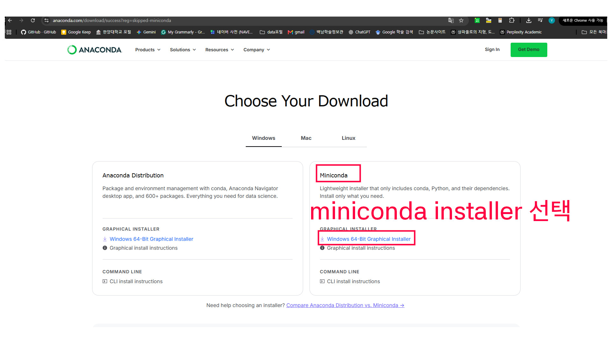
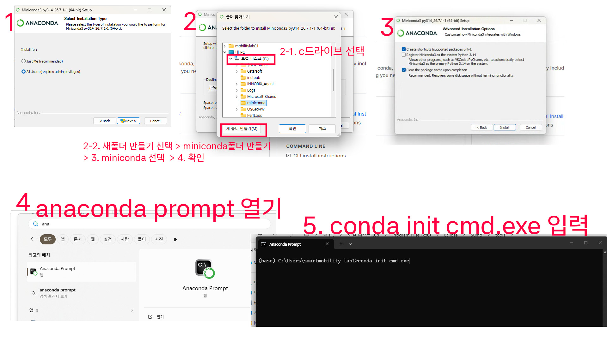
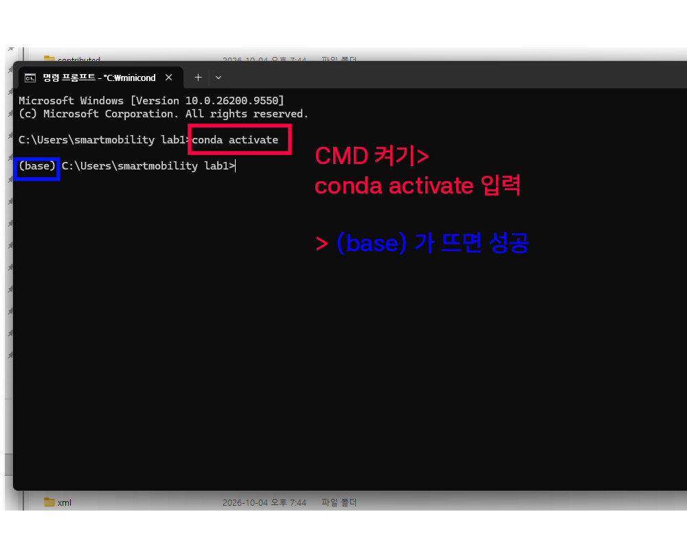

# Miniconda 설치 : 윈도우
## Miniconda 설치 
1. [Miniconda Installer page](https://www.anaconda.com/download/success?reg=skipped-miniconda) 접속 후, miniconda installer 다운로드


2. miniconda 설치파일을 열기, 아래의 그림과 지시사항에 따라 진행
3. Select Installation Type화면에서 All users 선택
4. Miniconda 설치 폴더 정하기 
   - Destination 옆 설치폴더 정하기 버튼 클릭 
   - 로컬디스크 C 선택
   - 새폴더만들기 선택
   - 새폴더 이름을 miniconda로 입력
   - 확인버튼 클릭

5. Advanced Installation Option에서 Create shortcuts, Clear the package cache upon completion 체크 박스 선택

6. 설치 완료 후, 윈도우 프로그램 창에서 anaconda prompt 찾아서 연 후, 아래의 명령어 입력
    - 이 작업을 하는 이유는 cmd 창에서 conda 명령어를 사용할 수 있게 하기 위해서입니다.
```cmd
conda init cmd.exe
```


7. 윈도우 프로그램 창에 cmd 입력, 관리자 권한으로 cmd 열기 클릭

8. cmd 창에 아래의  명령어 입력 후, 다음 명령줄 앞에 (base)가 아래 그림과 같이 뜨면 miniconda 설치 성공

