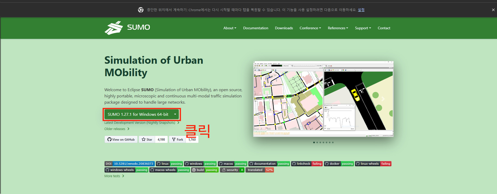
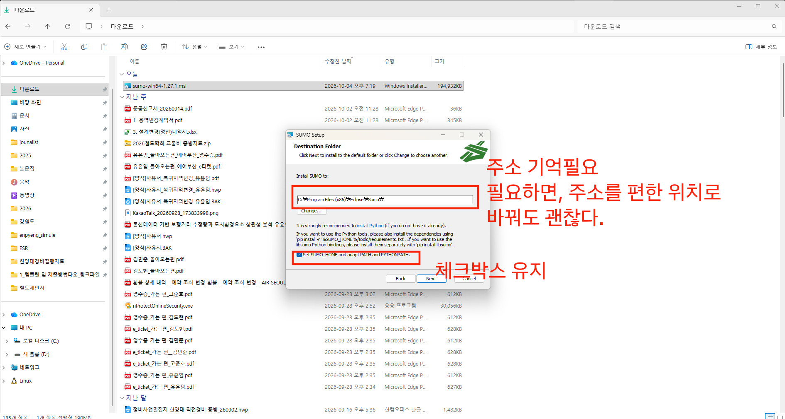
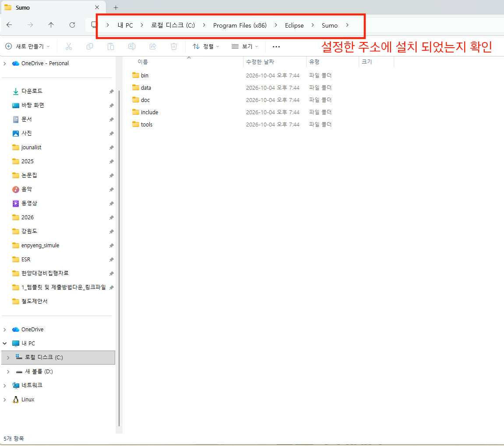
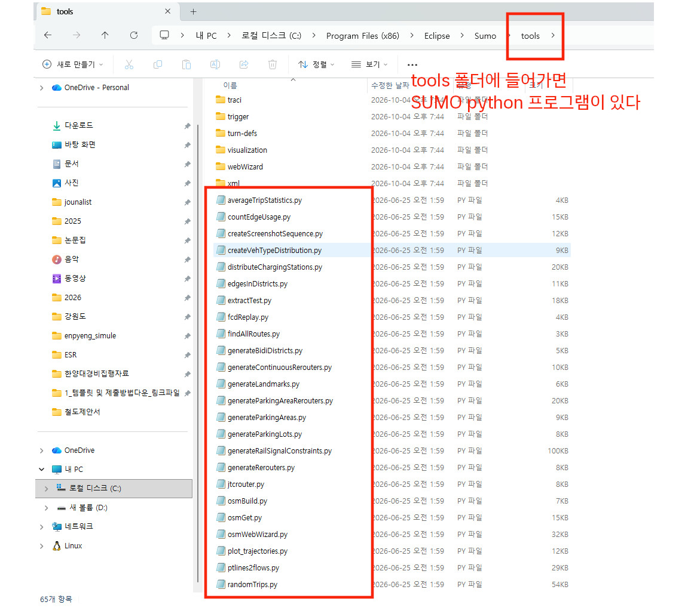
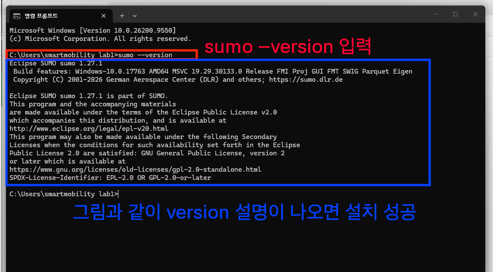
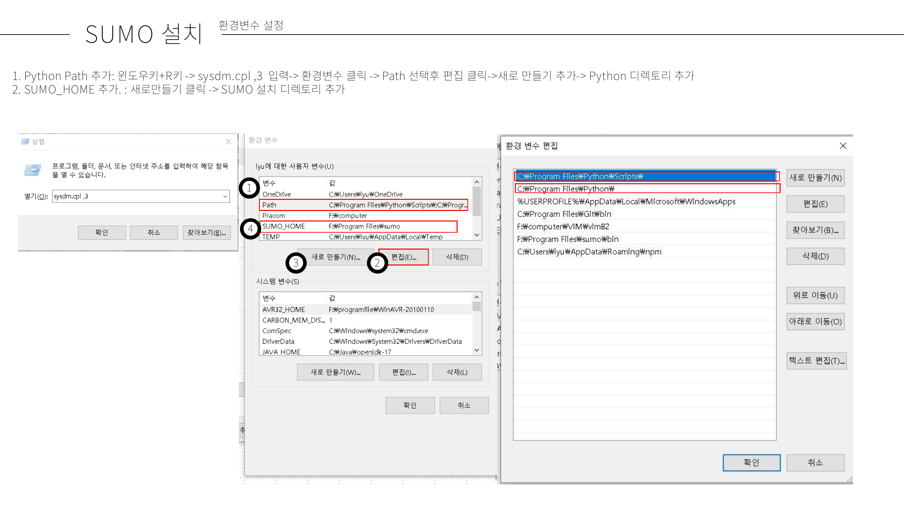

# SUMO 설치 : 윈도우 

1. [SUMO](https://eclipse.dev/sumo/) 접속, `SUMO 1.27.1 for Windows 64-bit`을 클릭하여 SUMO 설치 프로그램 다운로드


2. SUMO 설치 프로그램 클릭하여 설치 시작, SUMO 설치 주소는 디폴트 경로로 유지, `set SUMO_HOME and ` 체크박스 선택


3. 설정한 주소에 SUMO 폴더가 설치되어 있는지 확인
   - 디폴트 경로대로 설치하였다면, `내 pc > 로컬디스크 C > Program Files (x86) > Eclipse > Sumo`에 프로그램 폴더가 설치되어 있다.


4. tools 폴더 안에 SUMO python 프로그램이 있다. 각 프로그램별 기능은 [SUMO document](https://sumo.dlr.de/docs/index.html)에서 검색해서 찾아볼 수 있다.


5. CMD 창을 켜서, SUMO가 잘 작동하는지 확인한다. 만약, 프로그램 폴더가 있지만, CMD에서 sumo가 작동하지 않는다면 환경변수 설정에서 오류가 생긴 것으로 아래 환경변수 설정을 따라하자.

명령어 입력
```cmd
sumo --version
```



## sumo 환경변수 설정
환경변수 설정
1. sumo bin path를 환경변수로 설정해야합니다.
2. SUMO Path 환경변수 설정하기
3.내가 설치한 SUMO 폴더를 찾는다
4.SUMO 폴더에 들어간다
5.bin폴더에 들어간다.
6.폴더 바탕에서 오른쪽 키를 클릭한다
7.속성을 클릭한다
8.보안탭에 들어간다
9.개체 이름을 복사한다.
10. 복사한 값은 sumo bin 폴더의 path(주소)이다.
11. F:\Program Files\sumo\bin(자기 sumo>bin 폴더의 주소값)
12. 윈도우키>설정>시스템>정보>고급시스템 설정
>고급 Tab clik
1.  환경변수 클릭
2.  Path 클릭
3.  편집 클릭
4.  새로만들기 클릭
5.  복사한 주소값 넣기
6.  적용
7.  cmd 켜기
8.  작동확인
9.  ppt에 나와있는대로 SUMO_HOME, Path에 sumo bin 구성되어 있는 지 확인
10. 안되면 sumo 삭제 후, 디폴트 상태로 재설치(환경변수 추가에 Check하여 설치) or 메일로 문의

