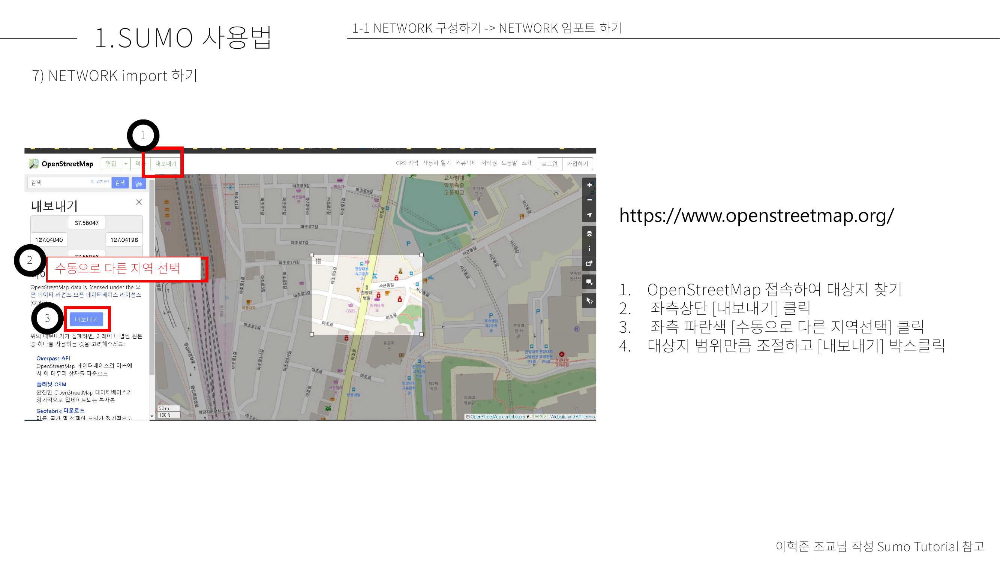
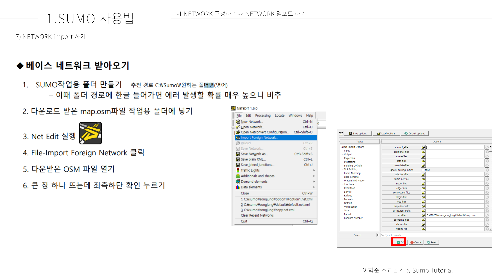

# OSM Network import

1. [OpenStreetMap](https://www.openstreetmap.org/) 접속
2. 대상지 찾기
3. 좌측상단 `내보내기` 클릭
4. `수동으로 다른 지역 선택` 클릭
5. 대상지 범위만큼 조절하고 `내보내기` 클릭 

6. osm_용 별도 프로젝트 폴더 만들기 `oms_sumo`와 같이 생성
7. 다운로드 받은 map.osm을 해당 프로젝트 폴더로 옮기기

8. `Net Edit` 실행하여 `File>Import Foreign Network`클릭
9. 다운로드 받은 `map.osm` 선택
10. 좌측 하단 확인 클릭

