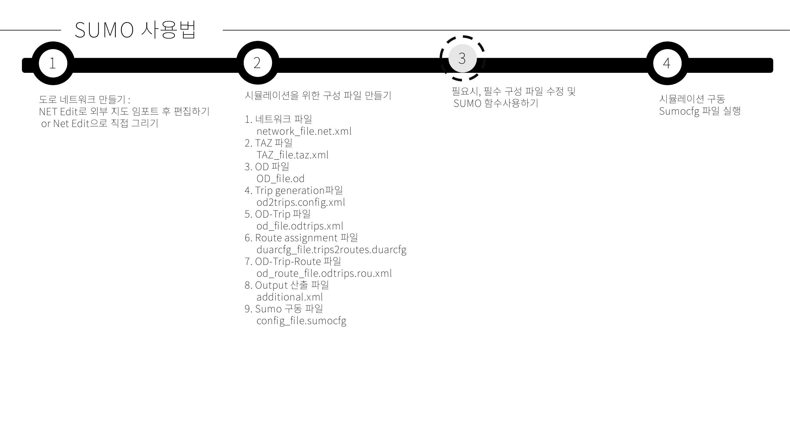
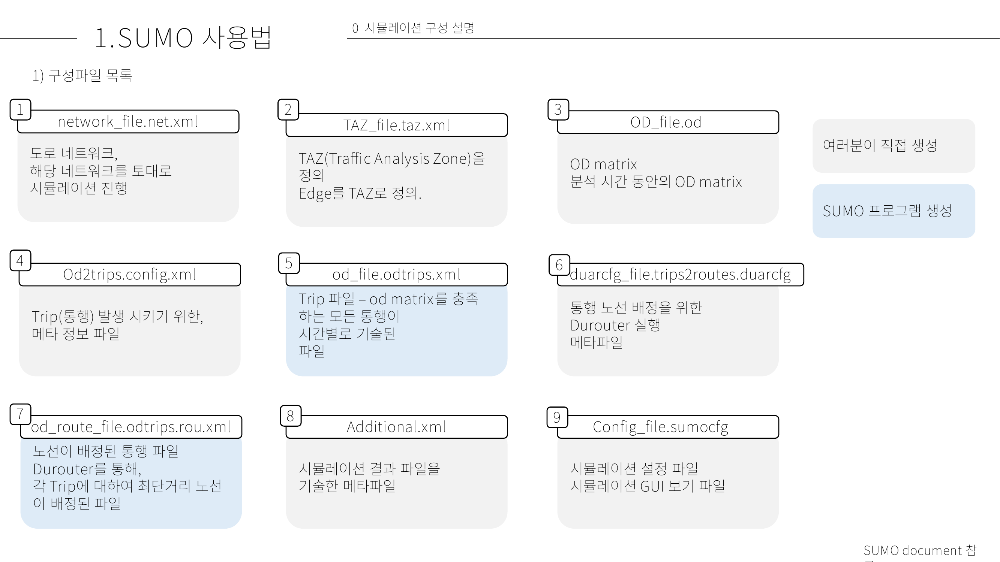
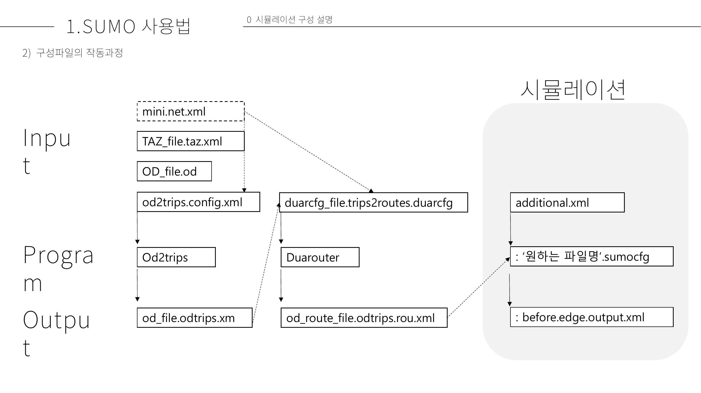

# 요약

## SUMO 사용 순서

1. 교통 공급(Supply) 정의
교통 인프라 공급을 정의하는 것
- Network 파일 만들기 
  - 도로 Edge 속성 설정
    - 차선 수
    - 허용 교통 수단
    - 최고 속도 등
  - 교차로 설정
  - 신호 설정 등

2. 교통 수요(Demand) 정의
교통 수요를 정의하는 것, TAZ와 OD 기반으로 정의할 수 있다.
- TAZ 파일 작성
  - TAZ에 속한 edge 작성, sink, source 구분
- OD matrix 작성
  - TAZ를 단위로 od matrix 작성
  - 시작시각, 종료시각 입력
- od2trips로 OD matrix에 따른 통행 생성
  - od2trips config 파일  
- duarouter로 통행에 경로 배정 
  - duarouter config 파일

3. 시뮬레이션 sumo 실행
  - sumo config 파일 작성
  - 시뮬레이션 실행
  - 결과 파일 확인  

## 요약

하기 그림에 나타난 duarcfg_file은 기초 실습의 duarouter config 파일이며, od2trips.config 또한 기초 실습의 od2trip의 config 파일입니다. additional.xml은 금번 기초실습에서 sumo config파일에 합쳐서 서술하였습니다.

